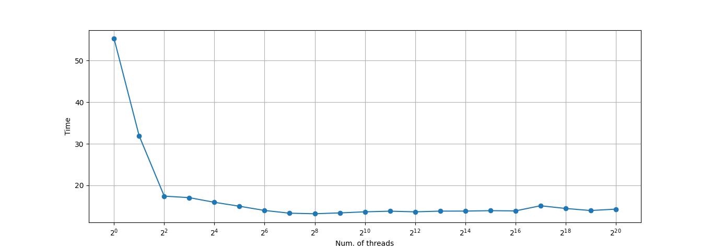

# Hash cracker
It is a simple multithreading app that could brute force such hashes as **SHA1**, **SHA256**, **SHA512** and **MD5**.

## Usage
    ./hashcracker -hash hexstring|-file path [-type sha1|sha256|sha512|md5] [-max val] [-min val] [-charset chars] [-threads num] 

    Usage of ./hashcracker:
    -charset string
          char set for possible message (default "0123456789abcdefghijklmnopqrstuvwxyzABCDEFGHIJKLMNOPQRSTUVWXYZ!\"#$%&'()*+,-./:;<=>?@[\\]^_`{|}~ \t\n\r\v\f")
    -file string
          path to file with hashes
    -hash string
          hash to be decrypted
    -max int
          max length of message (default 10)
    -min int
          min length of message (default 1)
    -threads int
          max number of threads (default 256)
    -type string
          hash algorithm (default "sha1")

## Setup
Clone the repository and change the working directory:

    git clone https://github.com/alexandr-gnrk/Hash-cracker
    cd Hash-cracker

Build and run the program:
    
    go build -o hashcracker
    ./hashcracker -hash aaf4c61ddcc5e8a2dabede0f3b482cd9aea9434d -charset abcdefghijklmnopqrstuvwxyz

## Examples

Crack **sha1** hash
  
    ./hashcracker -hash fc19318dd13128ce14344d066510a982269c241b

Crack **md5** hash with message length between 3 and 5 characters
    
    ./hashcracker -type md5 -min 2 -max 5 -hash 6b2ded51d81a4403d8a4bd25fa1e57ee

Crack **sha1** hash with custom char set
    
    ./hashcracker -hash b3da1b8c56c939e616aa3c0934bce72cb1e82b32 -charset abcdhijklm

Crack **sha256** with 512 threads
    
    ./hashcracker -type sha256 -threads 512 -hash 97c10efe01d5c9c88704a12d361d8429b3a6aa2412290a0773109d5d2d603d5e

Crack **sha1** hashes from file
    
    ./hashcracker -type sha1 -file ./hashes.txt

## Get elapsed time

Just use **time** command

    $ time ./hashcracker -hash 2e96e89125f4c1aef797410a4bfdb32c0632ef0c
    Start cracking hash 2e96e89125f4c1aef797410a4bfdb32c0632ef0c
    Check mesages with length: 1 | Possible variants: 100
    Check mesages with length: 2 | Possible variants: 10000
    Check mesages with length: 3 | Possible variants: 1000000
    Check mesages with length: 4 | Possible variants: 100000000
    =========> Message: emit

    real    0m29,028s
    user    1m47,758s
    sys 0m1,119s

## Output examples

Ex. 1

    $ ./hashcracker -hash fc19318dd13128ce14344d066510a982269c241b
    Start cracking hash fc19318dd13128ce14344d066510a982269c241b
    Check mesages with length: 1 | Possible variants: 100
    Check mesages with length: 2 | Possible variants: 10000
    Check mesages with length: 3 | Possible variants: 1000000
    Check mesages with length: 4 | Possible variants: 100000000
    =========> Message: good

Ex. 2

    $ ./hashcracker -max 5 -file ./hashes.txt -charset abcdefghijklmnopqrstuvwxyz/:.
    Start cracking hash c3437dbc7c1255d3a21d444d86ebf2e9234c22bd
    Check mesages with length: 1 | Possible variants: 29
    Check mesages with length: 2 | Possible variants: 841
    Check mesages with length: 3 | Possible variants: 24389
    Check mesages with length: 4 | Possible variants: 707281
    Check mesages with length: 5 | Possible variants: 20511149
    =========> Message: https

    Start cracking hash ef81042e1e86acb765718ea37393a1292452bbcc
    Check mesages with length: 1 | Possible variants: 29
    Check mesages with length: 2 | Possible variants: 841
    Check mesages with length: 3 | Possible variants: 24389
    =========> Message: ://

    Start cracking hash a3c1509bd8df6d72992b312e4f6b7f4ce7fd3f3d
    Check mesages with length: 1 | Possible variants: 29
    Check mesages with length: 2 | Possible variants: 841
    Check mesages with length: 3 | Possible variants: 24389
    Check mesages with length: 4 | Possible variants: 707281
    Check mesages with length: 5 | Possible variants: 20511149
    =========> Message: docs.

    Start cracking hash 3f95edc0399d06d4b84e7811dd79272c69c8ed3a
    Check mesages with length: 1 | Possible variants: 29
    Check mesages with length: 2 | Possible variants: 841
    Check mesages with length: 3 | Possible variants: 24389
    =========> Message: goo

## Optimal number of threads
According to plot below, recomended number of threads is near to 256 (256 is default).

Programm was tested on computer with 4 CPUs.
